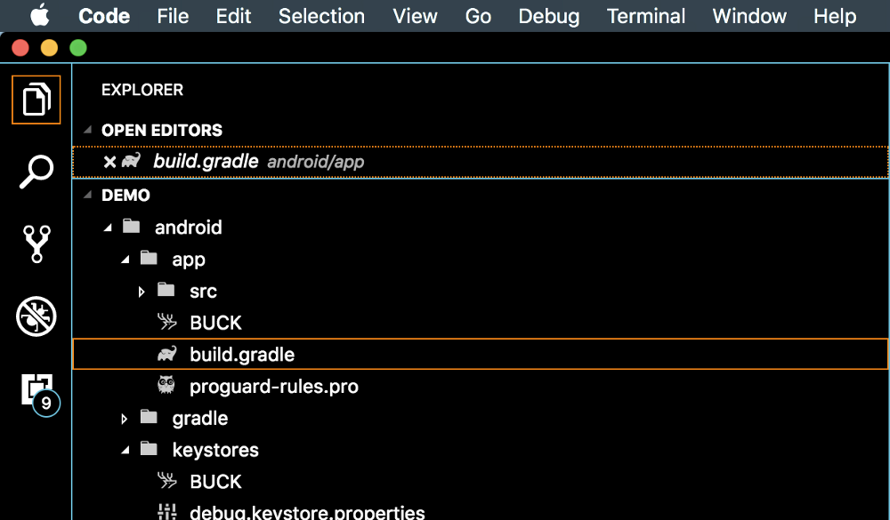

# Shrink your React Native application size dramatically!

<br/>

So you made a cool and awesome looking [React Native](https://facebook.github.io/react-native/) app and now you’re ready to build it and maybe publish it to the store —

But worried about it if the users would want to install it given its build size? Or maybe you just want to keep it light weight and not take too much memory unnecessarily when it can be packed into a smaller size?

Or you’re just one of us who are paranoid about build sizes? Don’t worry, we got you covered! 😄 ✔️

<hr />

In this article, we will cover the following two things:

* Compress our react native application size - by compressing the java bytecode that is generated while building our app and also asking it to try and shrink all the resources that are bundled with the application.
* Splitting our application bundle into multiple `apk`s to remove unnecessary code which is not required by the device which is going to run it - because a lot of code is bundled with the universal apk that is device specific - meaning that we don't need a lot of code in the device we're going to install it in.

<hr />

Let's get started! ✊

First of all, you’ll need to eject your native app if you’re using [create-react-native-app](https://github.com/react-community/create-react-native-app) for your project ( You might have already done this if you’ve built your application before reading this article ). This is important since you don’t have access to configurations until you eject, as the build folder is where we have to make changes. If you haven’t, you can simply do this by :

```
npm run eject
```

**Note :** Ejecting a react native application is a permanent action! ( Unless you’re using a version control system to keep track of previous versions of your app — from where you can recover the ‘unejected’ version of your app later if you need ). [Learn more about ejecting here.](https://github.com/react-community/create-react-native-app/blob/master/EJECTING.md")

Okay so now we’re all set! Let’s get started and get that done fast. Don’t worry it just takes a few minutes and your app size will shrink dramatically!

Now, navigate to the `android / app` folder from your project root directory where you can find your `build.gradle` file.



Here, you’ll find your default build configurations already setup, find the line which looks like this :

```
def enableProguardInReleaseBuilds = false
def enableSeparateBuildPerCPUArchitecture = false
```

and change their value to `true` like this :

```
def enableProguardInReleaseBuilds = true
def enableSeparateBuildPerCPUArchitecture = true
```

So you might be wondering what it does. Well, if you scroll down a bit you’ll see `enableProguardInReleaseBuilds` and `enableSeparateBuildPerCPUArchitecture` written at a few more places like here:


As you can see, these variables are being used to enable or disable two build configurations —

* One for generating separate .apks for different device architectures,

```
. . .
splits {
    abi {
      reset()
      enable enableSeparateBuildPerCPUArchitecture
      . . .
```

*Don’t worry about having to handle different .apks for each architecture — Google takes care of distributing it to the users! And separating the builds according to architecture removes unnecessary code from your file which is not required on the device it is running.*

* Another one for compressing the Java bytecode generated while building, as in,

```
. . .
buildTypes {
    release {
        minifyEnabled enableProguardInReleaseBuilds
        . . .
```

Phew, that was pretty easy! But wait, we’re not done yet! There’s one little thing we need to do.

Now let’s add this line right below the `minifyEnabled` configuration :

```
. . .
buildTypes {
    release {
        minifyEnabled enableProguardInReleaseBuilds
        shrinkResources true; /* <-- Add this line */
        . . .
```

And we’re done! Now build your app again and check the `output` directory. You’ll find two different `.apks` of your app which are specified in the configuration by default, i.e., for `armebi` and `x86` architectures.

Oh, and by the way if you need a universal `.apk` that supports all device architectures — just set `universalApk` to true and it’ll generate a universal `.apk` next time you run build!

That’s all! Now you’ve setup your build configuration to shrink your code along with resources and create separate `.apk` for different architectures — thus removing unnecessary code from the final build.

Thanks for reading! For more resources on how to reduce the application build size, [follow this link](https://developer.android.com/studio/build/shrink-code).

Happy Hacking! Cheers!

<hr />